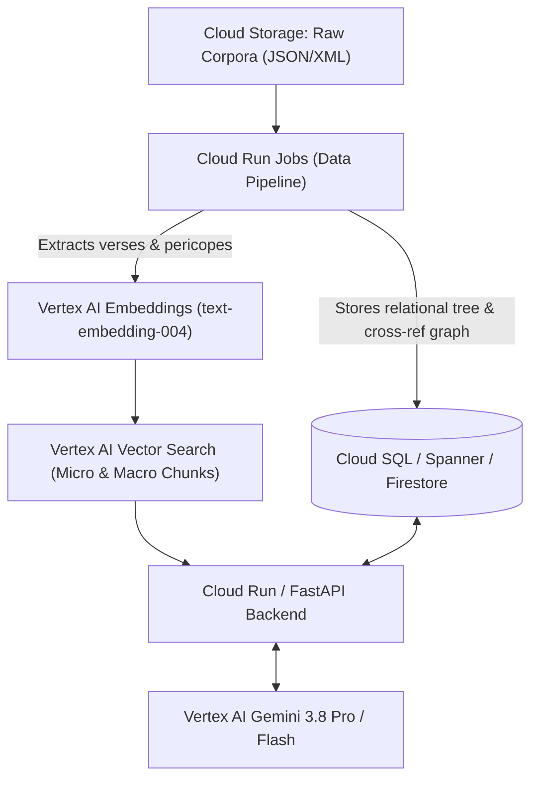

# Multi-Tradition Semantic Bible Engine (MTSBE) Architecture

Building a multi-tradition semantic Bible engine on Google Cloud requires three distinct architectural layers: a **hierarchical textual chunking pipeline**, a **linked-context knowledge store**, and an **augmented generation pipeline** that blends biblical narrative with rabbinic, patristic, and secular historiography.

---

## 1. Corpus Acquisition and Source Mapping

Rather than scraping Project Gutenberg plain text (which lacks structural markup), use structured domain-specific archives that already include book, chapter, verse, and commentary alignment:

| Corpus | Target Content | Recommended Source & Format | Structural Notes |
| --- | --- | --- | --- |
| **Biblical Texts** | Hebrew Bible / Old Testament, New Testament, Septuagint | **Open Scriptures / STEPBible** (JSON/OSIS XML) or **World English Bible (WEB)** / KJV via Crosswire | OSIS XML maintains explicit verse milestones (`<verse osisID="Gen.1.1"/>`) and pericope headings. |
| **Rabbinic & Midrash** | Midrash Rabbah, Tanchuma, Pirkei De-Rabbi Eliezer, Talmudic aggadah | **Sefaria Open-Data Dumps** (Available directly in Sefaria’s public Google Cloud Storage bucket and GitHub repo) | Contains pre-computed bi-directional links (`links.json`) tying specific biblical verses directly to Midrash segments. |
| **Early Church Fathers** | Ante-Nicene, Nicene, and Post-Nicene Fathers (Schaff edition, 38 vols) | **Christian Classics Ethereal Library (CCEL)** (ThML / XML) or Gutenberg | CCEL editions contain explicit Scripture indices mapping patristic homilies to biblical passages. |
| **Secular Historiography** | Flavius Josephus (*Antiquities of the Jews*, *The Jewish War*), Philo of Alexandria | **Perseus Digital Library** (TEI XML) or **Project Gutenberg** | Josephus corresponds chronologically to First and Second Temple periods, the Hasmonean dynasty, and Roman Judea. |

---

## 2. Hierarchical Chunking ("Parent-Document" Architecture)

Traditional fixed-token chunking (e.g., 500 tokens with 50-token overlap) destroys biblical context: verses get cut mid-sentence, poetic parallelism is severed, and pericopes (coherent thematic units such as *The Binding of Isaac* or *The Sermon on the Mount*) are fragmented across boundaries.

Adopt a **three-tier hierarchical schema**:

```
Book (Macro)
 └── Chapter
      └── Pericope / Narrative Unit (Parent Chunk: ~250–1,200 words)
           └── Verse / Micro-segment (Child Chunk: ~15–80 words)
```

### Chunking Logic

1. **Micro Chunks (Verses):**
   * Stored with exact citation keys: `urn:bible:gen.22.1`.
   * Embeddings generated at this level allow hyper-specific semantic search (e.g., finding the exact verse discussing "sacrificing a ram caught in a thicket").

2. **Parent Chunks (Pericopes):**
   * Grouped using canonical pericope boundaries (from UBS/NA28 editorial units, SBL Greek New Testament pericope datasets, or standard liturgical divisions like Parashot for the Torah).
   * Embeddings generated at the pericope level capture high-level themes (e.g., "divine testing", "covenantal inheritance").

3. **Retrieval Policy:**
   * When a query matches a specific verse chunk, retrieve its **parent pericope** plus its **linked commentary graph nodes** before sending context to the model.

### Chunk JSON Schema

```json
{
  "id": "gen-22-1-19-pericope",
  "type": "pericope",
  "corpus": "biblical",
  "book": "Genesis",
  "chapter_start": 22,
  "verse_start": 1,
  "chapter_end": 22,
  "verse_end": 19,
  "pericope_title": "The Binding of Isaac (Akedah)",
  "text": "After these things God tested Abraham and said to him...",
  "child_verse_ids": ["gen-22-1", "gen-22-2", "..."],
  "external_links": {
    "midrash": ["Genesis_Rabbah.55.1", "Tanchuma_Vayera.22"],
    "church_fathers": ["Chrysostom_Homilies_on_Genesis.47", "Augustine_City_of_God.16.32"],
    "secular": ["Josephus_Antiquities.1.13"]
  }
}
```

---

## 3. Google Cloud Architecture

To minimize cost while ensuring sub-second vector search and large-context grounding:

```
[Cloud Storage: Raw Corpora (JSON/XML)]
               │
               ▼
[Cloud Run Jobs (Data Pipeline)] ──> Extracts verses, pericopes, and cross-references
               │
       ┌───────┴───────────────────────┐
       ▼                               ▼
[Vertex AI Embeddings]      [Cloud SQL / Spanner / Firestore]
(text-embedding-004)        (Stores relational tree & Sefaria/CCEL link graph)
       │
       ▼
[Vertex AI Vector Search]
(Indexed by micro & macro chunks)
       │
       ▼
[Cloud Run / FastAPI Backend] <──> [Vertex AI Gemini 3.8 Pro / Flash]
```

### Architecture Flowchart



* **Storage & ETL:** Store raw datasets in **Cloud Storage**. Run containerized parsing scripts on **Cloud Run Jobs** (or **Dataproc Serverless** if handling heavy parallelized NLP parsing).
* **Vector Embeddings:** Generate dense vectors using Vertex AI's `text-embedding-004` (768-dimensional or reduced via MRL to 256/512 to save memory).
* **Vector Index:** Deploy to **Vertex AI Vector Search** (formerly Matching Engine) for approximate nearest neighbor (ANN) retrieval with metadata filtering (e.g., filter by `testament: OT`, `tradition: midrash`, or `source: josephus`).
* **Cross-Reference Store:** Store the relational and graph mappings (which verses connect to which midrashic sections, patristic homilies, and Josephus chapters) in **Cloud SQL for PostgreSQL** (with `pgvector` enabled if you want unified search) or **Spanner Graph**.
* **Generative Engine:** Use **Gemini 3.8 Pro (or Flash) on Vertex AI**. Its native 2-million-token context window is well-suited for ingesting entire chapters alongside full midrashic commentaries and multi-page treatises from Josephus without loss of resolution.

---

## 4. Multi-Perspective Generation Strategy

Direct semantic search often fails on ancient religious literature because terms are symbolic and typological (e.g., searching for "atonement" needs to capture the Akedah, the Scapegoat, and Roman crucifixion mechanics).

### Two-Stage Retrieval Flow

1. **Query Deconstruction:** An analytical prompt parses the user's inquiry into three sub-queries:
   * *Biblical Core:* Key biblical events, verses, or motifs.
   * *Traditional Exegesis:* Rabbinic debates (Midrash) or Patristic allegories/typologies.
   * *Historical/Material Culture:* Topography, Roman/Persian political reality, Josephus account.

2. **Hybrid Graph + Dense Retrieval:**
   * Fetch relevant biblical pericopes via **Vertex AI Vector Search**.
   * Traverse the **Cross-Reference Graph** to pull the explicit Midrash, Patristic commentary, and Josephus sections indexed against those pericopes.
   * Perform vector search across the non-biblical corpora to catch conceptual matches that lack explicit verse citations.

### Persona & Context-Integrated Story Generation Prompt

When generating contextual narratives, configure the system prompt to enforce historical and interpretive fidelity:

```text
You are an expert biblical historian, exegete, and narrative writer.
Synthesize the provided biblical narrative with its ancient interpretive and cultural layers:

1. Biblical Anchor: Ground the core action strictly in the retrieved pericope text.
2. Jewish Midrashic Layer (OT): Introduce rabbinic motifs, psychological subtext, 
   and dialogues recorded in Midrash Rabbah or Tanchuma (e.g., Satan's testing, Sarah's perspective).
3. Patristic Typology (NT): Weave in the theological and symbolic lens of the Early 
   Church Fathers where relevant (e.g., sacrificial imagery, prophetic fulfillment).
4. Material & Political Reality (Josephus): Ground the setting, sensory details, 
   military realities, topography, and political tensions using the historical records of Flavius Josephus.

Maintain a clear distinction between the primary biblical narrative and secondary 
historical/legendary traditions without breaking dramatic immersion.
```
