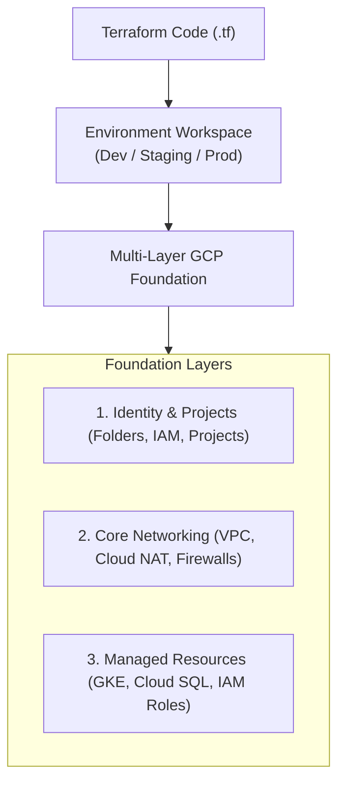

# Building Repeatable and Portable Complex GCP Architectures with Terraform

The standard way to build a complex, repeatable, and portable Google Cloud Platform (GCP) architecture is by using Infrastructure as Code (IaC), with Terraform by HashiCorp being the industry-standard tool.

While GCP offers its own native tool, [Google Cloud Deployment Manager](https://cloud.google.com/deployment-manager), Terraform is preferred for complex setups because it is completely open-source, highly portable across cloud providers, and supported directly by Google through official provider packages.

---

## The Core Workflow for Repeatable GCP Infrastructure

Building a complex, production-ready GCP architecture requires a structured, multi-layer approach to ensure security, isolation, and portability.

```
[ Terraform Code (.tf) ]
           │
           ▼
[ Environment Workspace ] (Dev / Staging / Prod)
           │
           ▼
[ Multi-Layer GCP Foundation ]
 ├── 1. Identity & Projects (Folders, IAM, Projects)
 ├── 2. Core Networking (VPC, Cloud NAT, Firewalls)
 └── 3. Managed Resources (GKE, Cloud SQL, IAM Roles)
```



---

## Best Practices

### 1. Use Modular Structure

Break your complex architecture into reusable, parameterized modules rather than writing a single monolithic file.

* **Resource Modules:** Define individual building blocks (e.g., a standardized VPC, a secure GKE cluster, or an encrypted Cloud SQL instance).
* **Composition Modules:** Combine resource modules to define an entire environment (e.g., a complete "environment topology" consisting of networking, compute, and database layers).

### 2. Isolate Environments with Workspaces and State Files

To ensure portability and repeatable deployments across Development, Staging, and Production, separate your environments structurally.

* Store your architecture's state remotely in a secure [Google Cloud Storage (GCS) bucket](https://cloud.google.com/storage) with state locking enabled.
* Use different backend prefixes or dedicated Terraform workspaces for each environment to prevent accidental overwrites.

### 3. Leverage the Cloud Foundation Fabric

For highly complex enterprise architectures, do not start from scratch. Google maintains the [Cloud Foundation Fabric](https://github.com/GoogleCloudPlatform/cloud-foundation-fabric), an official, production-ready blueprint of Terraform modules designed to accelerate building landing zones, hierarchical folder structures, data pipelines, and secure networking structures.

### 4. Parameterize for Portability

Hardcoding project IDs, regions, or IP ranges destroys portability. Instead:

* Pass environment-specific values via variable definitions (`.tfvars` files).
* Use a single codebase that takes a `project_id` and `region` as inputs, allowing you to replicate the exact same setup in a brand-new GCP organization within minutes.
